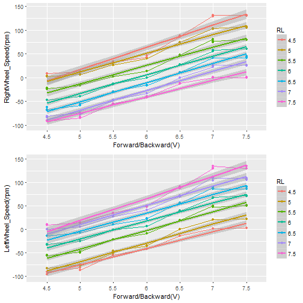

Permobil C500 Electrical Wheelchair Wheel Speed Estimation
========================================================
author: Charles
date: 09/25/2017
autosize: true
font-family: 'Helvetica'
transition: concave


Introduction
========================================================
Electric Wheelchair Permobil C500 uses two signals to control the speed of two wheels, thus control the movement of the wheelchair. These two signals are Forward/Backward and Right/Left. The range for both signals is from 4.5 V to 7.5 V. In order to estimate the movement of wheelchair for research experiment purpose, we need to know the relationship between these two signals and the wheel speed (rpm).

This app could calculate the speed of two wheels according to the two input signals. 

App website: [Click here for the app](https://charlesd.shinyapps.io/permobil_c500_electrical_wheelchair_wheel_speed_estimation/)

Data Set
========================================================

We use 0.5 V as a interval to change two input signals from 4.5 V to 7.5 V separately, and measure the speed of wheel three times per combination to get the data.
Here's the dataset:


```r
head(dataWheel)
```

```
   FB  RL   RW     LW RWSpeed LWSpeed
1 4.5 4.5 2.16 -22.75    8.64     -91
2 4.5 4.5 2.16 -23.75    8.64     -95
3 4.5 4.5 2.16 -22.75    8.64     -91
4   5 4.5    3  -20.5   12.00     -82
5   5 4.5    3  -20.5   12.00     -82
6   5 4.5 3.16 -21.75   12.64     -87
```

Plot
========================================================

Here's the plot for Right Wheel Speed (rpm) and Left Wheel Speed (rpm) according to different input Forward/Backward (V) and Right/Left (V) signals.



Links
=======================================================
- App Link

[Permobil C500 Electrical Wheelchair Wheel Speed  Estimation](https://charlesd.shinyapps.io/permobil_c500_electrical_wheelchair_wheel_speed_estimation/)

- More details about analysis could see here:

[Analysis of Control Signal and Wheel Speed of Permobil C500](https://rpubs.com/CharlesD/311471)

- Information about Permobil C500 Electrical Wheelchair:

[Permobil C500](https://marcsmobility.com/permobil-c500-silver-power-chair-used-electric-wheelchairs-08272015.html)

[Permobil C500 Owner's Manual](https://permobilus.com/wp-content/uploads/2016/12/OM-C500.pdf)


